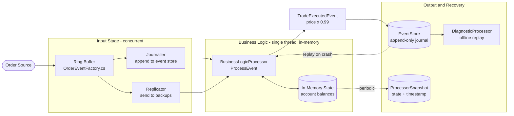
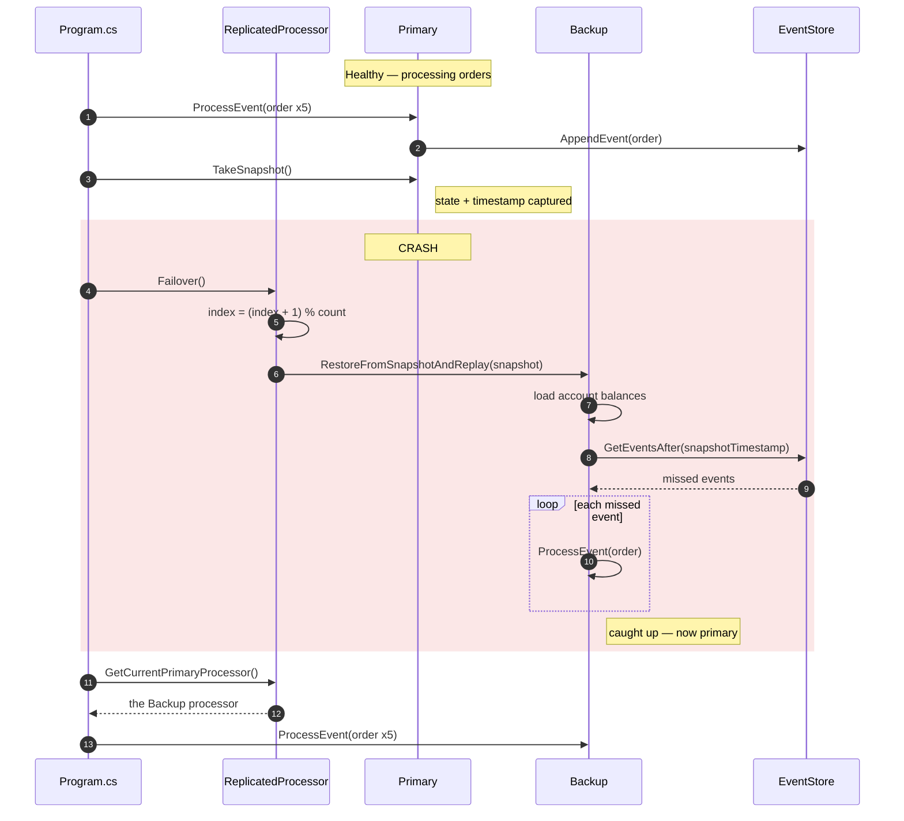

[](https://dotnet.microsoft.com/)
[](https://docs.microsoft.com/en-us/dotnet/csharp/)
[](https://martinfowler.com/articles/lmax.html)
[](https://github.com/AkbarDizaji/LMAX-TradingSystem)
[](https://github.com/AkbarDizaji/LMAX-TradingSystem)
[](https://opensource.org/licenses/MIT)
[](https://github.com/AkbarDizaji/LMAX-TradingSystem/stargazers/)

# LMAX Trading System

A small, readable C# implementation of the **LMAX architecture** — the design that let the LMAX exchange process
**6 million orders per second on a single thread**. This repository is a teaching project: every moving part is
deliberately kept small enough to read in one sitting, so you can see *why* the architecture works rather than
just that it does.

If you have never met the pattern before, start with Martin Fowler's write-up:
[martinfowler.com/articles/lmax.html](https://martinfowler.com/articles/lmax.html).

---

## Table of Contents

- [The Big Idea](#the-big-idea)
- [Architecture](#architecture)
- [Getting Started](#getting-started)
- [Tutorial: Walking Through a Run](#tutorial-walking-through-a-run)
- [How Failover Works](#how-failover-works)
- [Concepts, One at a Time](#concepts-one-at-a-time)
- [Wiring Up the Disruptor](#wiring-up-the-disruptor)
- [Known Simplifications](#known-simplifications)
- [Project Structure](#project-structure)
- [Further Reading](#further-reading)

---

## The Big Idea

Most systems chase throughput by adding threads, and then spend their lives fighting the locks, cache misses, and
non-determinism that threads bring. LMAX went the other way and asked a heretical question:

> What if the business logic ran on **one thread**, with **no database**, and **all state in memory**?

That sounds slow until you count the cost of what you removed. A lock-free hand-off between threads costs tens of
nanoseconds; a database round-trip costs milliseconds — a difference of roughly **100,000×**. If the business logic
never blocks on I/O and never contends for a lock, a single modern core is astonishingly fast.

Three ideas make it safe to do this:

| Idea | Problem it solves | Where it lives here |
| --- | --- | --- |
| **Event Sourcing** | In-memory state dies with the process | `EventSourcing/EventStore.cs` |
| **Snapshots** | Replaying millions of events at startup is slow | `EventSourcing/ProcessorSnapshot.cs` |
| **Replication / Failover** | One machine is a single point of failure | `Failover/ReplicatedProcessor.cs` |

The key insight tying them together: **if processing is deterministic and every input is journaled, then the state
is not precious.** You can always rebuild it by replaying the inputs. That is what makes it safe to keep everything
in RAM.

---

## Architecture

Orders flow left to right through the pipeline. The business logic in the middle is single-threaded and touches
nothing but memory — all the slow, concurrent work (I/O, journaling, replication) is pushed to the edges.



The two dotted lines are the recovery path: state is periodically captured into a snapshot, and on a crash the
journal is replayed on top of the most recent snapshot to rebuild everything that was lost.

---

## Getting Started

### Prerequisites

- **.NET 8.0 SDK** or higher — [download](https://dotnet.microsoft.com/download)
- Any C# IDE (Visual Studio, Rider, VS Code with the C# Dev Kit) — optional
- The [Disruptor](https://www.nuget.org/packages/Disruptor) NuGet package (v6.0.0), restored automatically

### Run it

```shell
git clone https://github.com/AkbarDizaji/LMAX-TradingSystem.git
cd LMAX-TradingSystem
dotnet restore
dotnet run --project LMAX-TradingSystem
```

> **Running a newer .NET than 8?** The project targets `net8.0`. If you only have the .NET 9/10 runtime installed,
> either install the .NET 8 runtime or roll forward:
> `DOTNET_ROLL_FORWARD=Major dotnet LMAX-TradingSystem/bin/Debug/net8.0/LMAX-TradingSystem.dll`

---

## Tutorial: Walking Through a Run

`Program.cs` is the guided tour. It runs five steps, and the console output tells the story of each one.

### Step 1 — Build the shared infrastructure

The event store and snapshot are created **once** and shared by every processor. This is what makes failover
possible: a backup can only take over if it can see the same journal the primary was writing to.

```csharp
EventStore eventStore = new EventStore();
ProcessorSnapshot snapshot = new ProcessorSnapshot();
```

### Step 2 — Create one primary and two backups

All three are identical. Nothing marks one as "the primary" except its position in the list.

```csharp
BusinessLogicProcessor primaryProcessor = new BusinessLogicProcessor(eventStore, snapshot);
BusinessLogicProcessor backupProcessor1 = new BusinessLogicProcessor(eventStore, snapshot);
BusinessLogicProcessor backupProcessor2 = new BusinessLogicProcessor(eventStore, snapshot);

ReplicatedProcessor replicatedProcessor = new ReplicatedProcessor();
replicatedProcessor.AddProcessor(primaryProcessor);
replicatedProcessor.AddProcessor(backupProcessor1);
replicatedProcessor.AddProcessor(backupProcessor2);
```

### Step 3 — Process five AAPL orders

Each order is journaled and turned into a trade at 99% of the asking price.

```
Primary processor is processing events...
Processing order for AAPL, Quantity: 100, Price: 150
Trade executed for AAPL, Quantity: 100, Price: 148.50
Processing order for AAPL, Quantity: 101, Price: 151
Trade executed for AAPL, Quantity: 101, Price: 149.49
...
Snapshot taken.
```

### Step 4 — Kill the primary and fail over

```
Simulating primary processor failure...
Failing over to a backup processor...
Restoring state from snapshot...
Processing order for AAPL, Quantity: 100, Price: 150     <-- replayed
Trade executed for AAPL, Quantity: 100, Price: 148.50
...
State fully restored after replaying events.
Failover complete. Backup processor is now the primary processor.
```

**This is the important moment.** The backup starts from a snapshot and then *replays the journal* to catch up.
Notice that the AAPL orders appear a second time — the backup is re-deriving state it never personally computed.
Because `ProcessEvent` is deterministic, replaying the same inputs produces exactly the same outputs.

### Step 5 — Carry on with the backup

```
Backup processor is now processing events...
Processing order for GOOG, Quantity: 105, Price: 2005
Trade executed for GOOG, Quantity: 105, Price: 1984.95
...
All events processed.
```

No orders were lost, and the caller never had to know a machine died.

> **Note:** your console may print `148,50` instead of `148.50` — `decimal` is formatted using your system's
> locale. Nothing is wrong.

---

## How Failover Works

The sequence below is what actually happens inside `ReplicatedProcessor.Failover()`.



The recovery cost is bounded by **snapshot age**, not by total history. Snapshot every 10,000 events and recovery
never replays more than 10,000 events, no matter how long the system has been running.

---

## Concepts, One at a Time

### Event Sourcing

Instead of storing *current state*, store the **sequence of facts that produced it**. `OrderPlacedEvent` is such a
fact — immutable, timestamped at construction:

```csharp
public class OrderPlacedEvent
{
    public string OrderId { get; set; }
    public string Symbol { get; set; }
    public int Quantity { get; set; }
    public decimal Price { get; set; }
    public DateTime Timestamp { get; set; }

    public OrderPlacedEvent() => Timestamp = DateTime.Now;
}
```

`EventStore` is an append-only journal. Appending is O(1) and never mutates history — the two properties that make
replay trustworthy:

```csharp
public void AppendEvent(OrderPlacedEvent orderEvent) => _eventJournal.Add(orderEvent);

public IEnumerable<OrderPlacedEvent> GetEventsAfter(DateTime snapshotTimestamp)
    => _eventJournal.Where(e => e.Timestamp > snapshotTimestamp);
```

You get auditing for free: the journal *is* a complete, ordered record of everything that ever happened.

### The Business Logic Processor

The heart of the system, and deliberately boring — no locks, no `async`, no I/O:

```csharp
public void ProcessEvent(OrderPlacedEvent orderEvent)
{
    TradeExecutedEvent tradeEvent = new TradeExecutedEvent
    {
        OrderId  = orderEvent.OrderId,
        Symbol   = orderEvent.Symbol,
        Quantity = orderEvent.Quantity,
        TradePrice = orderEvent.Price * 0.99m   // simulated execution logic
    };

    _eventStore.AppendEvent(orderEvent);
}
```

Determinism is the contract this method must honour. Same input sequence → same output sequence, always. Break it
with `DateTime.Now`, `Guid.NewGuid()`, or a random number *inside* the logic, and replay silently stops
reconstructing the truth. (Note that `OrderPlacedEvent` sets its timestamp in its **constructor**, at the edge of
the system — that is the right place for it.)

### Snapshots

A snapshot is a checkpoint: the state, plus the timestamp that says how far the journal has been folded in.

```csharp
public class ProcessorSnapshot
{
    public Dictionary<string, decimal> AccountBalances { get; set; } = new();
    public DateTime SnapshotTimestamp { get; set; }
}
```

The timestamp is the part that matters. Without it you cannot tell which journal entries are already reflected in
the state and which still need replaying.

### Diagnostics

Because the journal is complete, you can replay it into a *different* model without touching production state —
for debugging, analytics, or answering "what would have happened if…":

```csharp
DiagnosticProcessor diagnostics = new DiagnosticProcessor();
diagnostics.ReplayForDiagnostics(eventStore);
```

---

## Wiring Up the Disruptor

`Program.cs` calls `ProcessEvent` directly so the flow is easy to follow. The real LMAX design puts a **ring
buffer** in front of the processor — a fixed-size, pre-allocated array with lock-free sequence counters instead of
a queue. No allocation per message, no lock, and entries sit next to each other in memory so the CPU cache
prefetcher works in your favour.

`DisruptorSetup/OrderEventFactory.cs` already provides both pieces you need. Here is how to connect them:

```csharp
using Disruptor.Dsl;
using LMAX_TradingSystem.DisruptorSetup;

var disruptor = new Disruptor<OrderPlacedEvent>(
    () => new OrderPlacedEvent(),
    ringBufferSize: 1024,               // must be a power of two
    TaskScheduler.Default);

disruptor.HandleEventsWith(new OrderEventHandler(primaryProcessor));
var ringBuffer = disruptor.Start();

// Publish an order onto the ring
long sequence = ringBuffer.Next();
try
{
    var evt = ringBuffer[sequence];
    evt.OrderId  = Guid.NewGuid().ToString();
    evt.Symbol   = "AAPL";
    evt.Quantity = 100;
    evt.Price    = 150m;
}
finally
{
    ringBuffer.Publish(sequence);       // always publish, even on exception
}

disruptor.Shutdown();
```

Two details worth internalising:

1. **The buffer size must be a power of two.** That lets the Disruptor replace a modulo with a bitmask when
   wrapping the index.
2. **You mutate an existing slot rather than allocating a new event.** Objects are created once at startup, so a
   busy system generates almost no garbage and the GC stays quiet.

---

## Known Simplifications

This is a learning project, and a few corners are deliberately (or accidentally) cut. Spotting them is a good
exercise — each one is a genuine improvement waiting to be made:

- **Failover passes an empty snapshot.** `ReplicatedProcessor.Failover()` calls
  `RestoreFromSnapshotAndReplay(new ProcessorSnapshot())` rather than the snapshot the primary actually took. A
  fresh snapshot has `SnapshotTimestamp == DateTime.MinValue`, so `GetEventsAfter` returns the *entire* journal —
  which is why you see all five AAPL orders replayed in the output above. Correct behaviour would replay only the
  events after the last real snapshot.
- **Replay re-journals events.** `ProcessEvent` appends to the event store unconditionally, so replayed events are
  written a second time. There is an unused `_isReplaying` flag and an unused
  `ProcessEventWithoutStoreAppend` method that were clearly meant to prevent exactly this.
- **The journal is a `List<T>` in memory.** A real system writes to durable, sequential storage before
  acknowledging the order.
- **Timestamp ordering is fragile.** `DateTime.Now` has limited resolution, so events created in a tight loop can
  share a timestamp. Production systems use a monotonic **sequence number** instead.
- **Failover is round-robin, not health-based.** There is no heartbeat or leader election.
- **State is never actually mutated.** `TradeExecutedEvent` is created and printed but no balances change, so
  there is not yet meaningful state for a snapshot to capture.

---

## Project Structure

```
LMAX-TradingSystem/
├── Program.cs                            Entry point — the guided demo
├── Domain/
│   └── OrderPlacedEvent.cs               Input event (the journaled fact)
├── BusinessLogic/
│   ├── BusinessLogicProcessor.cs         Single-threaded core + replay
│   └── TradeExecutedEvent.cs             Output event
├── EventSourcing/
│   ├── EventStore.cs                     Append-only journal
│   └── ProcessorSnapshot.cs              State checkpoint + timestamp
├── Failover/
│   └── ReplicatedProcessor.cs            Primary/backup switching
├── Diagnostics/
│   └── DiagnosticProcessor.cs            Offline replay for analysis
└── DisruptorSetup/
    └── OrderEventFactory.cs              Ring buffer factory + handler
```

**Suggested reading order:** `OrderPlacedEvent` → `EventStore` → `BusinessLogicProcessor` → `ProcessorSnapshot` →
`ReplicatedProcessor` → `Program.cs`.

---

## Further Reading

- [The LMAX Architecture](https://martinfowler.com/articles/lmax.html) — Martin Fowler
- [Disruptor Technical Paper](https://lmax-exchange.github.io/disruptor/disruptor.html) — the original design doc
- [Disruptor-net](https://github.com/disruptor-net/Disruptor-net) — the .NET port used here
- [Mechanical Sympathy](https://mechanical-sympathy.blogspot.com/) — Martin Thompson on hardware-aware design

---

## Contributing

Contributions are welcome — the [Known Simplifications](#known-simplifications) list is a ready-made set of good
first issues. Please open an issue or submit a pull request.

## Support

If this helped you understand the LMAX architecture, consider leaving a star ⭐
